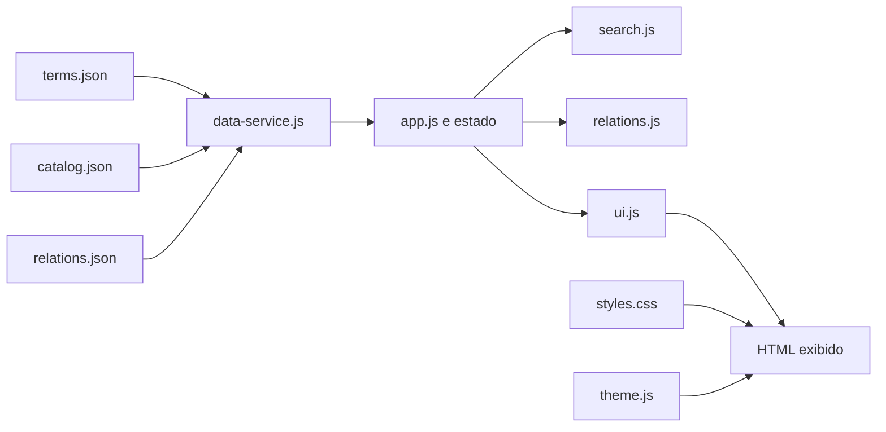

# Guia de apresentação e construção do projeto

Este documento tem dois objetivos:

1. ajudar a apresentar profissionalmente o projeto e o perfil no GitHub;
2. servir como roteiro de aula intermediária sobre as decisões técnicas e a construção do dicionário.

## 1. Identidade do projeto

### Nome

**Dicionário de Engenharia de Software e Tecnologia**

### Links oficiais

- site: [https://peadorno.github.io/dicionario-engenharia-software/](https://peadorno.github.io/dicionario-engenharia-software/)
- código-fonte: [https://github.com/peadorno/dicionario-engenharia-software](https://github.com/peadorno/dicionario-engenharia-software)
- perfil do autor: [https://github.com/peadorno](https://github.com/peadorno)

O link do site apresenta o produto funcionando. O link do repositório apresenta o processo de engenharia: código, dados, testes, histórico e documentação.

### Descrição curta recomendada

> Dicionário técnico interativo sobre Engenharia de Software, inteligência artificial e governança de metadados, com busca híbrida e relações explícitas entre conceitos.

### Descrição para o campo About do repositório

> Dicionário técnico estático com busca híbrida local, termos relacionados e conteúdo sobre software, IA e metadados. Construído com HTML, CSS, JavaScript e JSON.

### Topics recomendados para o GitHub

Os *topics* são etiquetas que ajudam outras pessoas a encontrar e entender o repositório.

- `software-engineering`
- `technology-dictionary`
- `javascript`
- `semantic-search`
- `knowledge-graph`
- `metadata-governance`
- `artificial-intelligence`
- `github-pages`
- `portfolio-project`
- `portuguese`

## 2. Como apresentar seu GitHub profissionalmente

O perfil deve responder rapidamente a quatro perguntas:

1. quem é você;
2. em quais áreas trabalha ou estuda;
3. quais problemas sabe resolver;
4. onde alguém pode ver evidências do seu trabalho.

### 2.1 Estrutura recomendada do perfil

Use uma foto ou avatar consistente, seu nome profissional e uma biografia curta. Uma sugestão de biografia é:

> Tecnologia, metadados e engenharia de software. Construindo projetos para organizar conhecimento e transformar conceitos técnicos em ferramentas úteis.

No README do perfil, quando ele for criado, uma apresentação possível é:

```markdown
# Olá, eu sou Pedro Adorno

Atuo na interseção entre tecnologia, mídia e governança de metadados.
Estou aprofundando meus conhecimentos em Engenharia de Software por meio de
projetos públicos, documentados e orientados a boas práticas.

## Projeto em destaque

- [Dicionário de Engenharia de Software e Tecnologia](https://github.com/peadorno/dicionario-engenharia-software)
  — aplicação web estática com busca híbrida, relações entre conceitos,
  testes automatizados e publicação no GitHub Pages.

## Interesses

- Engenharia de Software
- Inteligência artificial
- Governança de dados e metadados
- Mídia e tecnologia
```

### 2.2 Repositórios fixados

Fixe poucos repositórios e faça cada um representar uma competência. Este projeto pode demonstrar:

- modelagem de dados;
- arquitetura modular em JavaScript;
- qualidade e testes;
- experiência de usuário e acessibilidade;
- documentação técnica;
- Git, GitHub e publicação contínua com GitHub Pages;
- conhecimento de Engenharia de Software, IA e metadados.

Um perfil com dois ou três projetos claros costuma comunicar melhor do que uma lista extensa de exercícios sem contexto.

### 2.3 O que mostrar durante uma conversa

Ao apresentar o repositório, siga esta ordem:

1. abra o site e demonstre a busca;
2. pesquise uma intenção, como “publicar site”, para mostrar a busca híbrida;
3. abra um termo e mostre definição, explicação e exemplo;
4. clique em um termo relacionado e mostre a frase que conecta os conceitos;
5. abra o README e explique o objetivo do produto;
6. mostre `data/terms.json` e `data/relations.json` para explicar a modelagem;
7. mostre `src/search.js` para explicar o algoritmo de busca;
8. execute `npm test` para demonstrar qualidade;
9. mostre o histórico de commits para evidenciar evolução incremental.

Evite apresentar o projeto como “apenas um dicionário”. O valor técnico está na combinação entre conteúdo estruturado, recuperação de informação, relações em grafo, interface acessível, testes e publicação.

## 3. Como compartilhar o link do site

### 3.1 Qual link usar

Para alguém que deseja apenas utilizar o produto, envie:

[https://peadorno.github.io/dicionario-engenharia-software/](https://peadorno.github.io/dicionario-engenharia-software/)

Para recrutadores, desenvolvedores ou pessoas interessadas na implementação, envie também:

[https://github.com/peadorno/dicionario-engenharia-software](https://github.com/peadorno/dicionario-engenharia-software)

### 3.2 Mensagem curta

> Desenvolvi um dicionário técnico interativo sobre Engenharia de Software, IA e governança de metadados. Ele possui busca híbrida, relações entre conceitos e uma base estruturada em JSON. Você pode acessar em https://peadorno.github.io/dicionario-engenharia-software/

### 3.3 Mensagem profissional

> Estou desenvolvendo o Dicionário de Engenharia de Software e Tecnologia, um projeto pessoal que reúne conceitos de software, inteligência artificial e governança de metadados. A aplicação foi construída sem frameworks, com HTML semântico, CSS responsivo, JavaScript modular, dados em JSON e testes automatizados. A busca combina correspondência textual, tolerância a pequenas variações e expansão local de intenções. Site: https://peadorno.github.io/dicionario-engenharia-software/ — Código e documentação: https://github.com/peadorno/dicionario-engenharia-software

### 3.4 Currículo ou portfólio

> **Dicionário de Engenharia de Software e Tecnologia** — aplicação web estática com busca híbrida local, grafo de relações entre conceitos, tema claro/escuro, acessibilidade e testes automatizados. Tecnologias: HTML5, CSS, JavaScript, JSON, Node.js, GitHub Pages.

### 3.5 Cuidados ao compartilhar

- Use sempre o endereço HTTPS completo.
- Verifique o site em uma janela anônima antes de divulgar.
- Compartilhe o site e o código como links separados e identificados.
- Não envie o caminho local do computador, como `C:\Users\...`.
- Não compartilhe tokens, arquivos `.env`, credenciais ou URLs administrativas.
- Após um push, aguarde a publicação do GitHub Pages antes de anunciar uma mudança.

## 4. Roteiros para explicar o projeto

### 4.1 Em uma frase

> É uma aplicação web estática que organiza conhecimento técnico e permite encontrar e relacionar conceitos de Engenharia de Software, IA e governança de metadados.

### 4.2 Em trinta segundos

> O projeto nasceu para transformar uma lista de termos em uma base de conhecimento navegável. Modelei os verbetes e as relações em JSON, separei carregamento, busca, regras de relacionamento e interface em módulos JavaScript, e criei uma busca híbrida que entende nomes, aliases, conteúdo, pequenos erros e algumas intenções comuns. A aplicação não depende de backend nem framework, tem testes automatizados e é publicada no GitHub Pages.

### 4.3 Em dois minutos

> O Dicionário de Engenharia de Software e Tecnologia é um projeto de estudo e portfólio. A principal decisão arquitetural foi começar com a solução mais simples que atendesse ao problema: uma aplicação estática, executada inteiramente no navegador. O HTML fornece a estrutura semântica, o CSS implementa o sistema visual responsivo e os módulos JavaScript cuidam de dados, busca, relações, estado e renderização.
>
> A base separa verbetes completos de itens ainda em curadoria. Cada verbete possui identificador estável, categoria, aliases, definição, explicação e exemplo. As relações ficam em outro arquivo e formam um grafo: termos são nós e relações são arestas. Essa separação evita repetir dados e permite mostrar como dois conceitos participam do mesmo fluxo.
>
> A busca é híbrida e local. Ela normaliza texto, aplica pesos diferentes aos campos, tolera pequenas variações de escrita e expande intenções conhecidas. Não usa um modelo de IA externo nem envia a consulta para terceiros. As principais regras são funções puras e têm testes automatizados. O projeto é versionado com Git, documentado no GitHub e publicado por HTTPS no GitHub Pages.

## 5. Aula: como o dicionário foi construído

### 5.1 Objetivos de aprendizagem

Ao final da aula, uma pessoa com conhecimento intermediário deverá conseguir:

- explicar a arquitetura de uma aplicação web estática modular;
- modelar entidades e relações em JSON;
- separar regra de negócio, estado e apresentação;
- implementar uma busca ponderada e tolerante a pequenas variações;
- representar conexões como um grafo simples;
- usar atributos ARIA e navegação por teclado;
- escrever testes sem adicionar um framework;
- versionar e publicar um site com GitHub Pages;
- justificar decisões técnicas e seus trade-offs.

### 5.2 Problema e requisitos

Uma lista comum de definições não mostra como os conceitos se conectam. O projeto precisava atender a dois casos principais:

1. localizar rapidamente um conceito mesmo sem saber seu nome exato;
2. explicar como conceitos diferentes aparecem juntos em um processo técnico.

Requisitos não funcionais também orientaram a solução:

- **simplicidade:** evitar infraestrutura sem necessidade;
- **manutenibilidade:** permitir adicionar conteúdo sem reescrever a aplicação;
- **testabilidade:** manter regras importantes fora do DOM;
- **acessibilidade:** oferecer semântica e operação por teclado;
- **privacidade:** processar buscas localmente;
- **portabilidade:** funcionar em qualquer hospedagem de arquivos estáticos.

Um requisito funcional descreve o que o sistema faz. Um requisito não funcional descreve uma qualidade ou restrição, como desempenho, segurança ou facilidade de manutenção.

### 5.3 Decisão arquitetural

A aplicação usa uma arquitetura cliente estática:



O navegador carrega HTML, CSS, JavaScript e JSON. Não existe backend, banco de dados ou etapa de build.

#### Por que não usar um framework?

O estado e as interações atuais são pequenos. JavaScript nativo atende ao problema com menos dependências, menor superfície de atualização e carregamento direto pelo navegador. Um framework passaria a ser justificável se surgissem componentes complexos, múltiplas páginas, formulários extensos ou estado compartilhado difícil de coordenar.

#### Por que JSON em vez de banco de dados?

Os dados são públicos, predominantemente de leitura e publicados junto com o código. JSON oferece revisão por diff, histórico no Git e implantação sem servidor. Um banco de dados seria adequado quando houver edição concorrente, autenticação, consultas complexas ou volume incompatível com carregamento no navegador.

### 5.4 Organização do projeto

```text
.
├── assets/
│   ├── css/styles.css       # sistema visual e responsividade
│   └── favicon.svg          # identidade visual
├── data/
│   ├── terms.json           # verbetes completos
│   ├── catalog.json         # termos aguardando curadoria
│   └── relations.json       # conexões explícitas
├── docs/                    # arquitetura, fontes e procedimentos
├── src/
│   ├── app.js               # orquestração e estado
│   ├── data-service.js      # carregamento e validação
│   ├── search.js            # recuperação e ranqueamento
│   ├── relations.js         # operações sobre o grafo
│   ├── theme.js             # preferência visual
│   └── ui.js                # DOM e eventos
├── tests/                   # testes automatizados
├── index.html               # estrutura semântica
├── package.json             # metadados e comando de testes
└── README.md                # entrada da documentação
```

Essa divisão aplica **separação de responsabilidades**: cada módulo tem um motivo principal para mudar.

### 5.5 Modelo de dados

#### Verbete completo

```json
{
  "id": "deploy",
  "term": "Deploy",
  "category": "DevOps",
  "aliases": ["implantação"],
  "definition": "Definição curta e objetiva.",
  "explanation": "Explicação didática mais detalhada.",
  "example": "Exemplo do conceito em uma situação real."
}
```

O `id` é uma chave estável usada pelo código. O nome visível pode evoluir sem quebrar as relações. `aliases` melhora a recuperação porque permite pesquisar sinônimos e traduções.

#### Item em curadoria

```json
{
  "id": "catalogo-exemplo",
  "term": "Termo identificado",
  "category": "Categoria",
  "aliases": [],
  "status": "catalogado",
  "source": "Origem do termo"
}
```

O catálogo funciona como uma fila editorial. O termo pode ser encontrado, mas a interface informa que seu conteúdo ainda está em curadoria. Isso evita publicar definições genéricas como se fossem conteúdo final.

#### Relação

```json
{
  "id": "ci-deploy",
  "source": "ci",
  "target": "deploy",
  "type": "precedes",
  "explanation": "O CI executa verificações automatizadas antes do deploy."
}
```

Essa estrutura representa um grafo:

- o termo é um **nó**, ou vértice;
- a relação é uma **aresta**;
- `source` e `target` são as extremidades da aresta;
- `type` classifica a relação;
- `explanation` fornece a narrativa exibida ao usuário.

Manter relações fora dos verbetes cria uma única fonte de verdade e evita duplicar listas de termos relacionados.

### 5.6 Carregamento e validação

`data-service.js` usa `fetch` para carregar os três arquivos em paralelo com `Promise.all`. Uma *Promise* representa um resultado assíncrono: algo que estará disponível depois que a operação terminar.

Antes de entregar os dados à interface, o módulo verifica:

- se o conteúdo é uma lista;
- se campos obrigatórios existem e não estão vazios;
- se campos textuais são realmente textos;
- se aliases são listas de textos;
- se IDs seguem o padrão minúsculo separado por hífens;
- se IDs são únicos;
- se relações apontam para termos existentes;
- se não há autorrelação;
- se a mesma relação semântica não está duplicada;
- se URLs de fontes usam HTTPS.

Esse comportamento é conhecido como **fail fast**: rejeitar dados inválidos perto da origem, antes que o erro apareça como um defeito visual difícil de diagnosticar.

Ao carregar o catálogo, o serviço remove entradas que já existem como verbete ou alias. Depois adiciona textos provisórios apenas para compatibilidade com a interface. O campo `status` continua permitindo distinguir conteúdo completo de conteúdo em curadoria.

### 5.7 Estado e orquestração

`app.js` mantém o estado mínimo da sessão:

```js
const state = {
  terms: [],
  relations: [],
  query: "",
  selectedTermId: null,
  selectedRelationTermIds: new Set(),
};
```

**Estado** é o conjunto de dados que pode mudar durante o uso e influencia o que aparece na tela. Um `Set` é usado na seleção porque não permite IDs repetidos.

O módulo funciona como um coordenador:

1. solicita os dados ao serviço;
2. atualiza o estado;
3. chama a busca;
4. pede que a UI renderize resultados e detalhes;
5. consulta relações;
6. trata carregamento e erro.

Ele não implementa o algoritmo de busca nem cria elementos HTML diretamente. Essa separação reduz acoplamento.

### 5.8 Busca híbrida local

A busca é chamada de híbrida porque combina sinais diferentes. Ela não é uma busca vetorial e não usa embeddings ou um modelo de linguagem.

#### Etapa 1: normalização

`normalizeText`:

1. converte o valor para texto;
2. aplica Unicode NFD;
3. remove marcas de acento;
4. converte para minúsculas em `pt-BR`;
5. preserva caracteres técnicos relevantes, como `+`, `#` e `.`;
6. substitui outros separadores por espaço;
7. reduz espaços repetidos.

Assim, `Integração   Contínua` e `integracao continua` podem ser comparados de forma consistente.

#### Etapa 2: tokenização e stop words

**Tokenização** divide um texto em unidades menores, chamadas tokens. Palavras muito comuns, como “de”, “para” e “como”, são removidas por terem pouco valor discriminatório.

#### Etapa 3: campos ponderados

Cada campo contribui com um peso diferente:

| Campo | Peso |
|---|---:|
| nome do termo | 100 |
| aliases | 90 |
| categoria | 55 |
| definição | 35 |
| explicação | 22 |
| exemplo | 12 |

Encontrar a consulta no nome deve ser mais importante do que encontrá-la apenas dentro de um exemplo.

A frase exata recebe um multiplicador maior; prefixos e ocorrências parciais recebem multiplicadores progressivamente menores. Isso é um **ranking**, isto é, uma ordenação por relevância.

#### Etapa 4: flexões e erros pequenos

Uma função simples de *stemming* remove algumas terminações para aproximar flexões. Stemming reduz palavras a uma forma comparável; não é uma análise linguística completa.

A distância de edição mede quantas inserções, remoções ou substituições transformam uma palavra em outra. O algoritmo usa programação dinâmica para calcular essa distância. Palavras suficientemente longas aceitam distância um ou dois com pontuação reduzida.

Essa tolerância é uma forma controlada de **fuzzy matching**, ou correspondência aproximada. Ela não deve ser confundida com compreensão semântica geral.

#### Etapa 5: cobertura da consulta

Quando uma consulta possui vários tokens, a pontuação direta é multiplicada pela proporção encontrada. Isso evita que um termo receba posição alta por corresponder a apenas uma palavra de uma pergunta maior.

#### Etapa 6: expansão de intenções

O projeto possui um vocabulário explícito de intenções. Por exemplo:

- “publicar site” adiciona sinais para GitHub Pages, hospedagem estática e deploy;
- “desfazer versão com problema” adiciona sinais para rollback e produção;
- “enviar commits” adiciona sinais para push, remote e origin.

Essa é uma expansão semântica baseada em regras. Ela é local, previsível e testável. A principal vantagem é privacidade e determinismo; a limitação é compreender apenas intenções cadastradas.

#### Etapa 7: cache e ordenação

Os campos normalizados são guardados em um `WeakMap`. Cache é o reaproveitamento de um resultado calculado para evitar trabalho repetido. O `WeakMap` associa o índice ao objeto do termo sem impedir que o coletor de lixo libere o objeto quando ele não for mais usado.

Os resultados são ordenados por pontuação e, em caso de empate, alfabeticamente em português. A interface mostra no máximo seis sugestões para manter a lista objetiva.

### 5.9 Relações entre conceitos

`relations.js` expõe duas operações principais.

`findRelatedTerms` percorre todas as arestas conectadas ao termo atual, independentemente de ele aparecer como origem ou destino. Agrupa relações por termo, remove duplicatas e ordena alfabeticamente.

`findRelationsBetween` recebe os IDs selecionados e:

1. remove IDs repetidos;
2. cria um conjunto para buscas rápidas;
3. mantém apenas arestas cujas duas extremidades foram selecionadas;
4. elimina duplicatas;
5. ordena conforme a ordem de seleção;
6. informa quais termos ficaram desconectados.

Na interface, clicar em um termo relacionado produz uma frase com os dois conceitos e a explicação cadastrada. A aplicação não inventa a relação; ela apresenta conteúdo editorial explícito.

### 5.10 Interface e acessibilidade

`index.html` usa elementos semânticos como `header`, `nav`, `main`, `section`, `article`, `form`, `fieldset` e `footer`. Semântica ajuda navegadores, mecanismos de busca e tecnologias assistivas a entender a estrutura.

A pesquisa segue o padrão de **combobox** com lista de sugestões:

- `role="combobox"` identifica o controle composto;
- `aria-autocomplete="list"` informa que existem sugestões;
- `aria-controls` conecta o campo à lista;
- `aria-expanded` indica se a lista está aberta;
- `role="listbox"` e `role="option"` descrevem resultados;
- setas navegam pelas sugestões;
- `Escape` fecha a lista;
- `/` move o foco para a busca.

Regiões com `aria-live` anunciam mudanças importantes para leitores de tela. O foco visível permite acompanhar a navegação por teclado.

`ui.js` cria elementos pelo DOM e usa `textContent`, evitando inserir conteúdo dos dados como HTML. Isso reduz o risco de injeção de marcação.

### 5.11 Sistema visual e responsividade

`styles.css` centraliza cores, tamanhos, raios e larguras em propriedades customizadas, também chamadas de variáveis CSS. O tema escuro redefine esses tokens sem duplicar todo o conjunto de regras.

O layout usa CSS Grid:

- a busca ocupa a largura superior;
- em telas amplas, detalhes e comparação formam duas colunas;
- em telas estreitas, os painéis formam uma coluna;
- a navegação e o rodapé ocupam toda a largura;
- o conteúdo mantém largura máxima para preservar legibilidade.

Os principais *breakpoints* são `56rem` para o layout em duas colunas e `35rem` para ajustes de telas pequenas. Um breakpoint é o ponto em que regras de layout mudam conforme a largura disponível.

### 5.12 Tema claro e escuro

`theme.js` escolhe o tema nesta ordem:

1. preferência salva em `localStorage`;
2. preferência do sistema obtida por `prefers-color-scheme`;
3. tema claro como alternativa segura.

`localStorage` é um armazenamento simples do navegador associado à origem do site. O código captura falhas de leitura ou escrita para que a aplicação continue funcionando mesmo quando esse armazenamento estiver indisponível.

O atributo `data-theme` no elemento raiz seleciona os tokens CSS. O código também atualiza `aria-label`, `aria-pressed`, `title` e `meta[name="theme-color"]`.

### 5.13 Estratégia de testes

O projeto usa `node:test`, o executor incluído no Node.js. Não há dependência de teste instalada.

As suítes verificam:

- integridade dos três arquivos de dados;
- campos obrigatórios, IDs e duplicatas;
- referências e duplicatas nas relações;
- separação entre catálogo e verbetes completos;
- normalização, pesos, intenção e erros de digitação na busca;
- relações diretas, ordem e termos desconectados;
- IDs e referências ARIA do HTML;
- existência dos arquivos locais referenciados;
- resolução e alternância de tema.

Execute:

```powershell
npm test
```

Testes automatizados são rápidos e repetíveis, mas não substituem avaliação visual. O checklist em [`manual-testing.md`](manual-testing.md) cobre teclado, responsividade, temas, mensagens e versão publicada.

### 5.14 Execução local

Módulos JavaScript e `fetch` precisam de uma origem HTTP. Por isso, abrir `index.html` com `file://` pode ser bloqueado pela política de segurança do navegador.

Na raiz do projeto, execute:

```powershell
python -m http.server 8000
```

Depois abra:

```text
http://localhost:8000
```

`localhost` aponta para o próprio computador. O servidor é apenas para desenvolvimento; não envia o projeto para a internet.

### 5.15 Versionamento e publicação

O fluxo básico é:

```powershell
git status
git diff
npm test
git add README.md docs/
git diff --cached --check
git commit -m "docs: ampliar guia tecnico do projeto"
git push origin main
```

Conceitos envolvidos:

- **working tree:** arquivos atuais no computador;
- **staging area:** mudanças selecionadas para o próximo commit;
- **commit:** registro versionado com autor, data e mensagem;
- **branch:** linha de desenvolvimento; neste projeto, `main` é publicada;
- **remote:** referência para o repositório externo;
- **origin:** nome convencional do remote principal;
- **push:** envio de commits locais para o remote.

O GitHub Pages lê a raiz da branch `main` e publica os arquivos. Como não existe build, o arquivo enviado é o mesmo executado no navegador. Essa simplicidade reduz pontos de falha, mas exige que `main` permaneça sempre publicável.

### 5.16 Segurança e privacidade

O projeto não precisa de segredo em produção. Nenhuma credencial deve ser incluída no Git.

Antes de um commit:

- revise `git diff`;
- não adicione `.env`, tokens ou chaves;
- verifique a origem de conteúdo importado;
- preserve atribuição e licenças;
- evite dados internos ou pessoais;
- valide links externos com HTTPS;
- execute os testes.

A busca local oferece uma propriedade útil de privacidade: o texto digitado não é enviado a uma API de pesquisa ou IA.

## 6. Trade-offs das decisões

| Decisão | Benefício | Limitação | Quando reavaliar |
|---|---|---|---|
| Site estático | baixo custo e publicação simples | sem edição multiusuário | autenticação ou edição online |
| JSON versionado | diff e histórico legíveis | carregamento integral no cliente | base muito grande ou consultas complexas |
| JavaScript nativo | nenhuma dependência de produção | componentes manuais | interface e estado muito maiores |
| Busca por regras | privada, rápida e determinística | vocabulário semântico limitado | necessidade de linguagem natural ampla |
| Relações explícitas | explicações confiáveis | curadoria manual | escala que exija inferência ou caminhos |
| Test runner nativo | configuração mínima | sem DOM real | interações complexas ou regressões visuais |
| Publicação da `main` | fluxo direto | todo push pode alterar produção | equipe maior ou releases controlados |

Um trade-off é uma troca consciente: ganhar uma qualidade costuma impor algum custo ou limitação.

## 7. Como reconstruir o projeto do zero

### Etapa 1: definir o problema

Escreva os casos de uso antes do código: buscar, consultar, navegar por relações e comparar conceitos. Defina também o que ficará fora do MVP.

### Etapa 2: iniciar o repositório

```powershell
git init
git branch -M main
```

Crie `.gitignore`, `README.md`, licença e a estrutura de pastas. Faça um primeiro commit apenas com a fundação.

### Etapa 3: modelar os dados

Comece com poucos termos completos e relações verificáveis. Defina IDs estáveis e regras de validação antes de ampliar a base.

### Etapa 4: criar o HTML semântico

Implemente busca, região de detalhes, comparação, navegação e “Sobre”. Inclua estados vazios e mensagens de erro desde o início.

### Etapa 5: carregar e validar JSON

Use `fetch`, valide tipos e referências e trate falhas. Não deixe a UI assumir que os dados estão corretos.

### Etapa 6: separar regras puras

Implemente busca e relações como funções que recebem dados e devolvem resultados, sem acessar `document`. Isso permite testar regras com Node.js.

### Etapa 7: coordenar o estado

Mantenha somente o estado necessário. Faça `app.js` ligar dados, regras e UI, evitando transformar o coordenador em um módulo com todas as responsabilidades.

### Etapa 8: renderizar com segurança

Crie elementos DOM e atribua textos por `textContent`. Registre eventos em um local previsível e atualize atributos ARIA junto com o estado visual.

### Etapa 9: criar o sistema visual

Defina tokens CSS, largura máxima, espaçamento, tipografia e cores. Construa primeiro para uma coluna, depois adicione o layout amplo com media query.

### Etapa 10: testar continuamente

Teste cada regra nova e mantenha um checklist manual. Um defeito corrigido deve receber um teste quando for possível reproduzi-lo de forma automática.

### Etapa 11: publicar

Crie o repositório remoto, envie `main`, habilite o GitHub Pages e verifique a URL pública em janela anônima.

### Etapa 12: evoluir em incrementos

Cada incremento deve ser pequeno o suficiente para revisar, testar, explicar e reverter. Atualize código, dados, testes e documentação no mesmo ciclo.

## 8. Glossário técnico da implementação

| Termo | Explicação neste projeto |
|---|---|
| HTML semântico | elementos que expressam a função do conteúdo |
| DOM | representação em objetos da página carregada pelo navegador |
| módulo ES | arquivo JavaScript com importações e exportações explícitas |
| JSON | formato textual usado para armazenar dados estruturados |
| estado | dados mutáveis que determinam a interface atual |
| função pura | função previsível que não depende nem altera estado externo |
| cache | reutilização de resultado já calculado |
| normalização | transformação de textos para uma forma comparável |
| tokenização | divisão de texto em unidades menores |
| stemming | redução heurística de flexões a uma forma aproximada |
| fuzzy matching | correspondência aproximada entre textos parecidos |
| ranking | ordenação dos resultados por pontuação de relevância |
| grafo | estrutura formada por nós e arestas |
| nó | entidade do grafo; aqui, um termo |
| aresta | ligação entre dois nós; aqui, uma relação |
| ARIA | atributos que complementam a semântica para acessibilidade |
| responsividade | adaptação do layout ao espaço disponível |
| breakpoint | largura em que o CSS muda a organização do layout |
| fail fast | interrupção antecipada quando uma entrada é inválida |
| trade-off | troca entre vantagens e limitações de uma decisão |
| MVP | menor versão que entrega o valor principal e permite aprender |
| GitHub Pages | hospedagem estática integrada ao repositório GitHub |

## 9. Roteiro sugerido para uma aula de 90 minutos

1. **10 minutos — problema e escopo:** por que o projeto existe e como o MVP foi delimitado.
2. **15 minutos — arquitetura:** módulos, dados e fluxo de inicialização.
3. **15 minutos — modelagem:** termos, catálogo e grafo de relações.
4. **20 minutos — busca:** normalização, pesos, similaridade, cobertura e intenção.
5. **10 minutos — interface:** DOM, acessibilidade, responsividade e tema.
6. **10 minutos — testes:** demonstração de `npm test` e leitura de casos.
7. **10 minutos — Git e publicação:** commit, push e GitHub Pages.

Exercícios possíveis:

- cadastrar um novo verbete completo;
- criar uma relação e seu teste;
- adicionar uma intenção semântica;
- escrever um teste para um erro de digitação;
- identificar uma decisão que exigiria backend;
- explicar por que a busca atual não é busca vetorial.

## 10. Perguntas que você deve saber responder

### Por que você não usou React ou outro framework?

Porque o escopo atual é pequeno, a interface é uma página e o JavaScript nativo oferece modularidade suficiente. A decisão reduz complexidade e pode ser revista se o produto crescer.

### Essa busca usa inteligência artificial?

Não usa um modelo externo. Ela combina recuperação textual ponderada, correspondência aproximada e expansão semântica por regras explícitas. É inteligente no sentido de combinar sinais, mas é determinística.

### Por que separar catálogo e verbetes completos?

Para distinguir descoberta de termo e conteúdo editorial aprovado. Isso permite aumentar cobertura sem fingir que toda definição já foi revisada.

### Por que relações ficam em outro arquivo?

Porque são entidades próprias. A separação evita duplicidade, melhora validação e permite tratar a base como um grafo.

### Como você garante qualidade?

Com validação de dados no carregamento, funções puras, testes automatizados, checklist manual, revisão de diff, commits incrementais e publicação simples.

### Qual seria a próxima evolução técnica?

As opções mais coerentes são melhorar a curadoria dos termos catalogados, adicionar caminhos no grafo, automatizar verificações no GitHub Actions e avaliar uma busca vetorial somente se houver necessidade comprovada.

## 11. Mensagem central

O projeto demonstra que engenharia não é escolher a tecnologia mais complexa. É entender o problema, definir limites, modelar dados, separar responsabilidades, testar regras, documentar decisões e entregar uma solução que possa evoluir com segurança.
